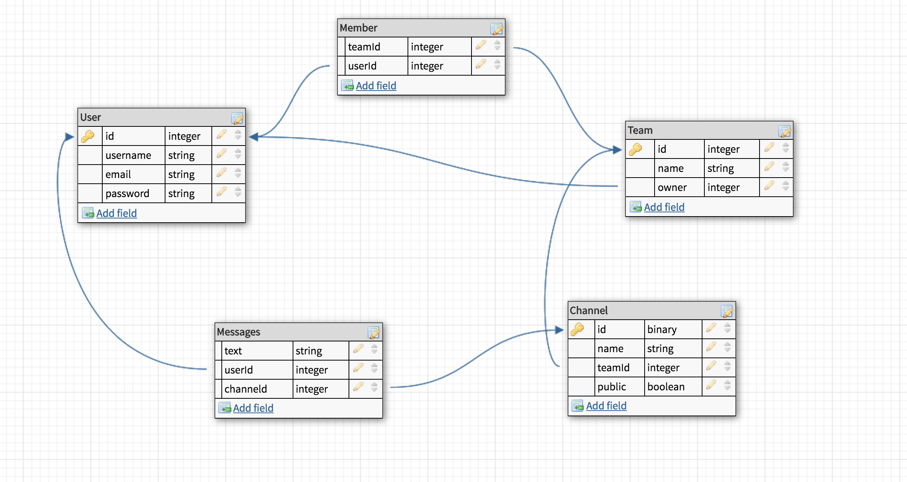

# SlackClone - Server
Slack clone client using React, GraphQL, Apollo Client, Mobx, etc.

## Features
* Create Teams
* Create Users
* Create Channels
* Authentication using JWTs
* Invite existing Users to Channels
* Switch between Teams and Channels
* Real-time messaging with GraphQL Subscriptions
* CSS Grid with Styled Components
* React Router Private Routing 

## App Overview

## Real-time Chat with GraphQL Subscriptions 

## Login Page - Authentication using JWTs

## Postgres Schema Diagram
